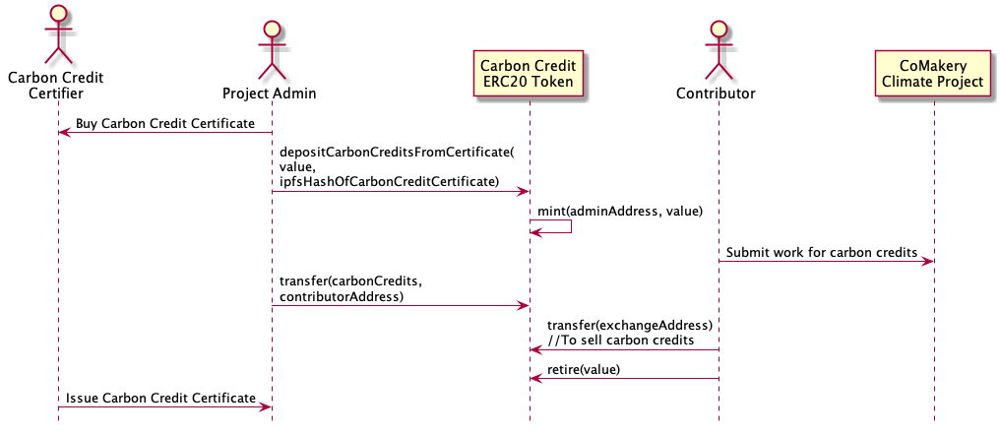

STATUS: Experimental

# Comakery Carbon Credit

A an ERC20 token backed by carbon credits - allows certified issuance, transfer and retirement.

## How It Works

1. The project admin purchases carbon credits from a certifier such as [Gold Standard](https://www.goldstandard.org/)
1. The project admin upload the certificate purchase details to IPFS and gets the file address called the ipfs Hash
1. The project admin calls the depositCarbonCreditsFromCertificate functioin on the Carbon Credit ERC20 token with the value of the certificate. Note that the token has 18 decimals of precision so it should be the value of carbon credits times 10^18.
1. The project admin now has the value of the certificate in their account. Other people can view the event log to see the carbon certificate ipfs hash and look it up on ipfs to verify the certificate.
1. A contributor contributes work to a Climate Impact Project on CoMakery
1. The admin pays the contributor in carbon credits
1. The contributor transfers some of their tokens to an exchange to sell
1. The contributor retires the remaining carbon credit tokens to offset some of their own carbon footprint.

