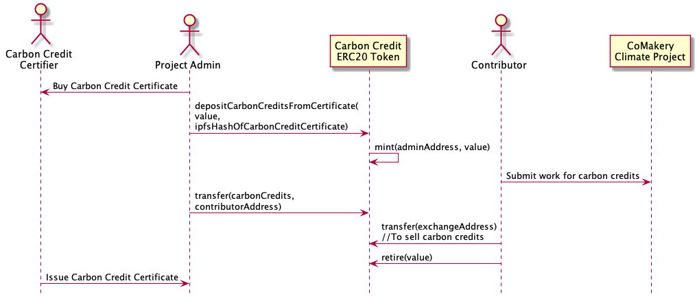

STATUS: Experimental

# CoMakery Carbon Credit

A an ERC20 token backed by carbon credits - allows certified issuance, transfer and retirement.

## How It Works



1. The project admin purchases carbon credits from a certifier such as [Gold Standard](https://www.goldstandard.org/)
1. The project admin upload the certificate purchase details to IPFS using a service like [Pinata](https://pinata.cloud) and gets the file address called the ipfs Hash. For example: the ipfs hash `QmUEGNbwdjLjk7C2hh2WDFwkNjixszwH3B1sFWqLseXTPi` can be used to look up a certificate receipt at any ipfs gateway like [https://gateway.pinata.cloud/ipfs/QmUEGNbwdjLjk7C2hh2WDFwkNjixszwH3B1sFWqLseXTPi](https://gateway.pinata.cloud/ipfs/QmUEGNbwdjLjk7C2hh2WDFwkNjixszwH3B1sFWqLseXTPi) or [https://cloudflare-ipfs.com/ipfs/QmUEGNbwdjLjk7C2hh2WDFwkNjixszwH3B1sFWqLseXTPi](https://cloudflare-ipfs.com/ipfs/QmUEGNbwdjLjk7C2hh2WDFwkNjixszwH3B1sFWqLseXTPi)
1. The project admin uses a smart contract like [Etherscan dApp explorer](https://ropsten.etherscan.io/dapp/0x85ACf61EE09C3FC771013Cd2f5ddF891DA1C8D01) to call the `depositCarbonCreditsFromCertificate` function on the Carbon Credit ERC20 token with the value of the certificate. Note that the token has 18 decimals of precision so it should be the value of carbon credits times 10^18.
1. The project admin now has the value of the certificate in their account. Other people can view the event log to see the carbon certificate ipfs hash and look it up on ipfs to verify the certificate.
1. A contributor contributes work to a Climate Impact Project on CoMakery
1. The admin pays the contributor in carbon credits
1. The contributor transfers some of their tokens to an exchange to sell
1. The contributor retires the remaining carbon credit tokens to offset some of their own carbon footprint.
1. The contributor has impacted the climate and a new carbon credit certificate is issued to the Project Admin
1. The Project Admin deposits the carbon credit certificate in the CoMakery Climate Project and the cycle continues.

# Deployment

## (1) Copy the `.env` file with 

```
cp .env.example .env
```

## (2) Then fill in the `.env` values 

for your Infura Ethereum node API key and Ethereum private key.

## (3) Install truffle globally

```
npm install -g truffle
```

## (4) Deploy the smart contracts
Deploy to `ropsten` testnet or another Ethereum blockchain network like `mainnet` with:

```
truffle deploy --compile-all --reset --network ropsten-infura
```

## (5) Write down your the contract address

So you can find the address on Etherscan or other networks. It will appear in the deploy output and look like this:
```
   Replacing 'CarbonCredit'
   ------------------------
   ...
   > contract address:    0x85ACf61EE09C3FC771013Cd2f5ddF891DA1C8D01
   ...
```

## (6) Publish the verified code to [Etherscan](https://github.com/gnosis/verify-on-etherscan)

You will need to create an account on Etherscan.
Change the  `--network` arugument to the network you deployed to (e.g. ropsten, mainnet, etc):

```
API_KEY=<your_etherscan_api_key> npx verify-on-etherscan --network ropsten  ./build/contracts/*
```
