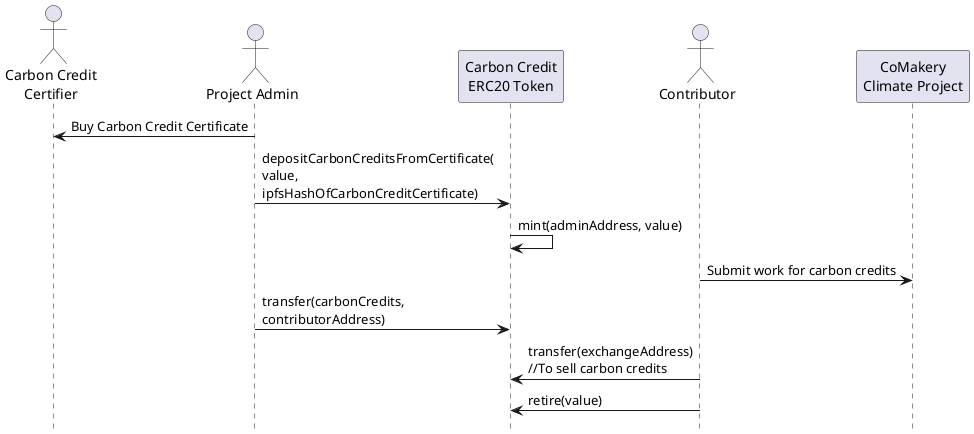

```plantuml
@startuml carbon-credits
hide footbox
actor Certifier as "Carbon Credit\nCertifier"
actor Admin as "Project Admin"
participant Token as "Carbon Credit\nERC20 Token"
actor Contributor
participant CoMakery as "CoMakery\nClimate Project"
Admin -> Certifier: Buy Carbon Credit Certificate
Admin -> Token: depositCarbonCreditsFromCertificate(\nvalue,\nipfsHashOfCarbonCreditCertificate)
Token -> Token: mint(adminAddress, value)
Contributor -> CoMakery: Submit work for carbon credits
Admin -> Token: transfer(carbonCredits,\ncontributorAddress)
Contributor -> Token: transfer(exchangeAddress)\n//To sell carbon credits
Contributor -> Token: retire(value)
@enduml
```